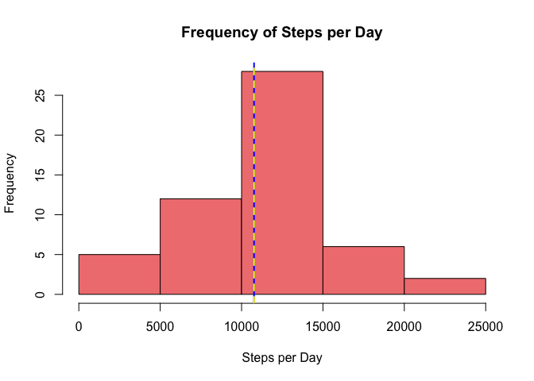
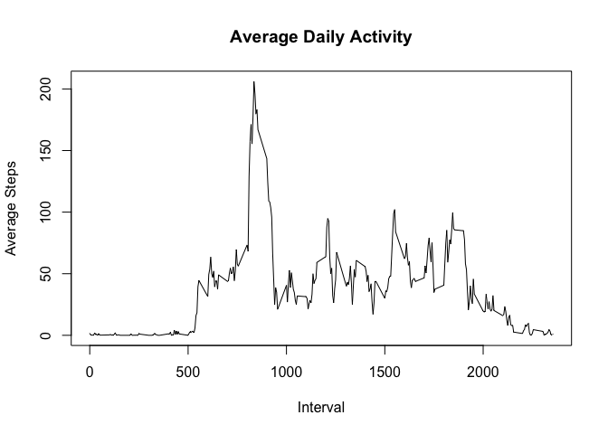
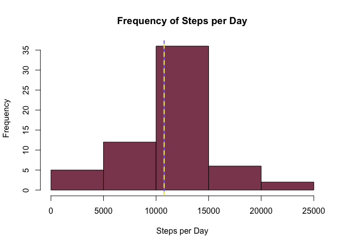
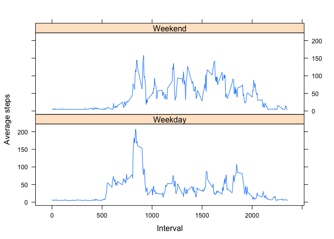

# Reproducible Research Project 1

##Loading and Preprocessing Data


```r
setwd("~/Documents/Data Science")
data <- read.csv(file = 'activity.csv')
head(data)
```

```
##   steps       date interval
## 1    NA 2012-10-01        0
## 2    NA 2012-10-01        5
## 3    NA 2012-10-01       10
## 4    NA 2012-10-01       15
## 5    NA 2012-10-01       20
## 6    NA 2012-10-01       25
```

```r
str(data)
```

```
## 'data.frame':	17568 obs. of  3 variables:
##  $ steps   : int  NA NA NA NA NA NA NA NA NA NA ...
##  $ date    : Factor w/ 61 levels "2012-10-01","2012-10-02",..: 1 1 1 1 1 1 1 1 1 1 ...
##  $ interval: int  0 5 10 15 20 25 30 35 40 45 ...
```

#What is mean total number of steps taken per day?


```r
#Aggregate the sum of steps for each day
steps_per_day <- aggregate(data$steps ~ data$date,na.action = na.omit,FUN = sum)
colnames(steps_per_day) <- c("Date", "Steps")
str(steps_per_day$Steps)
```

```
##  int [1:53] 126 11352 12116 13294 15420 11015 12811 9900 10304 17382 ...
```

```r
hist(steps_per_day$Steps,xlab = 'Steps per Day'  ,main = 'Frequency of Steps per Day', col = "lightcoral")
step_mean <- mean(steps_per_day$Steps)
step_median <-median(steps_per_day$Steps)
abline(v = step_mean , lwd = 2, col = 'blue')
abline(v = step_median, lwd = 2, lty = 2, col = 'yellow')
```

<!-- -->

The median of the steps per day data as calculated above is 10765 steps. The average steps per day is 10766.188. These are also pictured in the histogram of steps per day as a blue and yellow line.

##What is the average daily activity pattern?


```r
steps_interval_per_day<- aggregate(data$steps ~ data$interval,na.action = na.omit,FUN = mean)
str(steps_interval_per_day)
```

```
## 'data.frame':	288 obs. of  2 variables:
##  $ data$interval: int  0 5 10 15 20 25 30 35 40 45 ...
##  $ data$steps   : num  1.717 0.3396 0.1321 0.1509 0.0755 ...
```

```r
plot(steps_interval_per_day, type = 'l', xlab = 'Interval', ylab = 'Average Steps', main = 'Average Daily Activity')
```

<!-- -->

```r
max_step <- max(steps_interval_per_day$`data$steps`)
max_interval <- steps_interval_per_day[steps_interval_per_day$`data$steps` == max_step,]
max_interval
```

```
##     data$interval data$steps
## 104           835   206.1698
```

```r
#abline(h = max_step)
```
The graph showing the average steps for each daily activity is created above. The maximum amount of steps through the day is about 206 steps at time interval 835.

##Imputing missing values

```r
na <- is.na(data)
na_count <- sum(na)
na_count
```

```
## [1] 2304
```

The total number of NA values is 2,304.


```r
library('Hmisc')
```

```
## Loading required package: lattice
```

```
## Loading required package: survival
```

```
## Loading required package: Formula
```

```
## Loading required package: ggplot2
```

```
## 
## Attaching package: 'Hmisc'
```

```
## The following objects are masked from 'package:base':
## 
##     format.pval, round.POSIXt, trunc.POSIXt, units
```

```r
mean_per_day<- aggregate(data$steps ~ data$date,na.action = na.omit,FUN = mean)
colnames(mean_per_day) <- c('Date', 'Steps')
ndata <- data
ndata$steps <- impute(ndata$steps, fun=mean)
#check
nsteps_per_day <- aggregate(ndata$steps ~ ndata$date,na.action = na.omit,FUN = sum)
colnames(nsteps_per_day) <- c("Date", "Steps")
hist(nsteps_per_day$Steps,xlab = 'Steps per Day'  ,main = 'Frequency of Steps per Day', col = "palevioletred4")
nstep_mean <- mean(nsteps_per_day$Steps)
nstep_median <-median(nsteps_per_day$Steps)
abline(v = nstep_mean , lwd = 2, col = 'lightslateblue')
abline(v = nstep_median, lwd = 2, lty = 2, col = 'yellow')
```

<!-- -->

```r
nstep_mean
```

```
## [1] 10766.19
```

```r
nstep_median
```

```
## [1] 10766.19
```

After imputing the data the mean and median are the same at 10766.19 steps. This is slightly higher than before the data was imputed. Imputing the data does change the data slightly but does not have a large impact.

##Are there differences in activity patterns between weekdays and weekends?


```r
days <- weekdays(as.Date(ndata$date))
daycol <- vector()
for (i in 1:nrow(ndata)) {
    if (days[i] == "Saturday" | days[i] == "Sunday") {
        daycol[i] <- "Weekend"
    } else {
        daycol[i] <- "Weekday"
    }
}

ndata$daytype <-daycol
colnames(ndata)
```

```
## [1] "steps"    "date"     "interval" "daytype"
```

```r
ndata$daytype <- factor(ndata$daytype)
str(ndata)
```

```
## 'data.frame':	17568 obs. of  4 variables:
##  $ steps   :Class 'impute'  atomic [1:17568] 37.4 37.4 37.4 37.4 37.4 ...
##   .. ..- attr(*, "imputed")= int [1:2304] 1 2 3 4 5 6 7 8 9 10 ...
##  $ date    : Factor w/ 61 levels "2012-10-01","2012-10-02",..: 1 1 1 1 1 1 1 1 1 1 ...
##  $ interval: int  0 5 10 15 20 25 30 35 40 45 ...
##  $ daytype : Factor w/ 2 levels "Weekday","Weekend": 1 1 1 1 1 1 1 1 1 1 ...
```

```r
steps_per_daytype <- aggregate(steps~daytype + interval ,data = ndata, FUN = mean )
xyplot(steps ~ interval | daytype, data = steps_per_daytype, type = 'l' ,xlab="Interval",
    ylab="Average steps", layout=c(1,2))
```

<!-- -->


